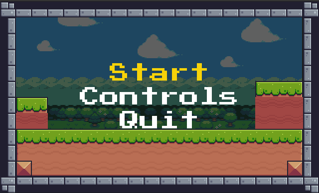
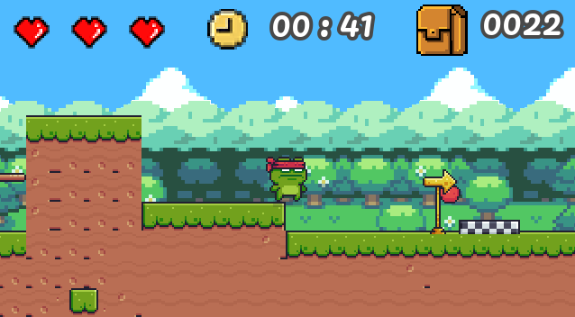
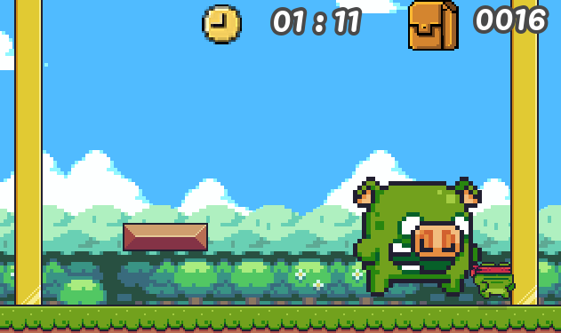

<h1 align="center">Pixeladventure</h1>

  
  
  

## Tecnologias

Esse projeto foi desenvolvido com as seguintes tecnologias:

- [Godot Engine](https://godotengine.org/)

## Projeto

Pixeladventure é jogo de plataforma classico

## Para rodar o game:

  - Clone o repositorio, depois import o jogo com a Godot
